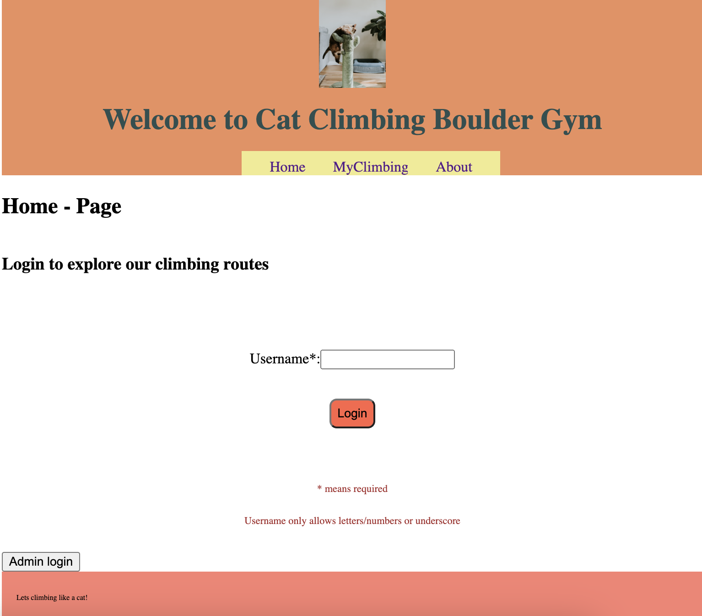
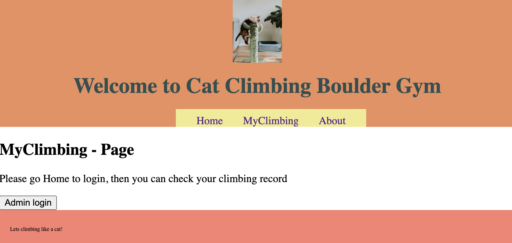
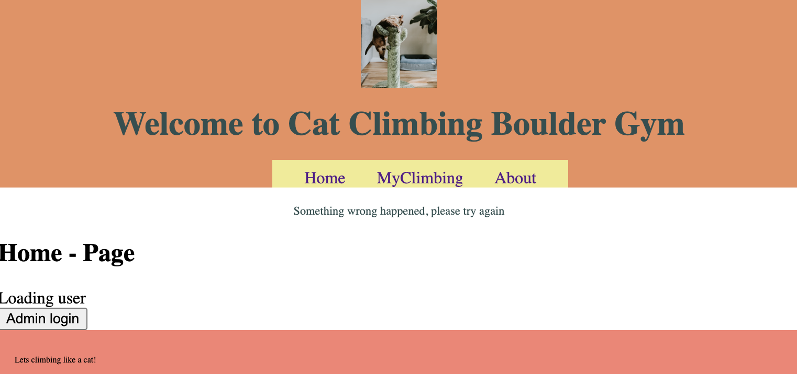
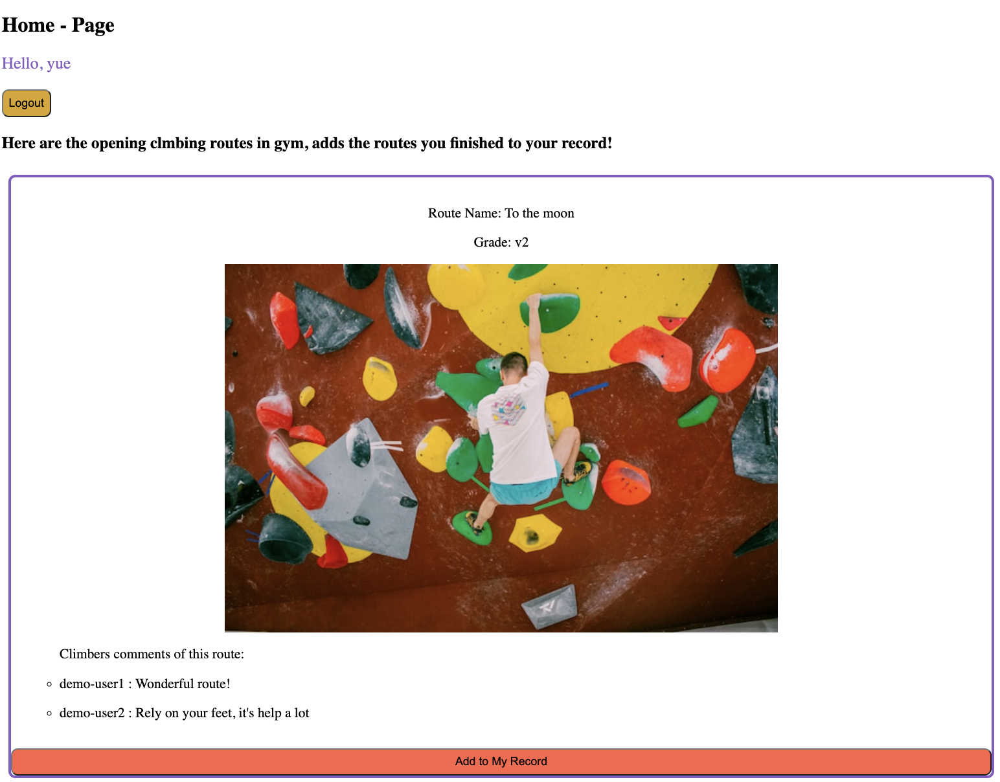
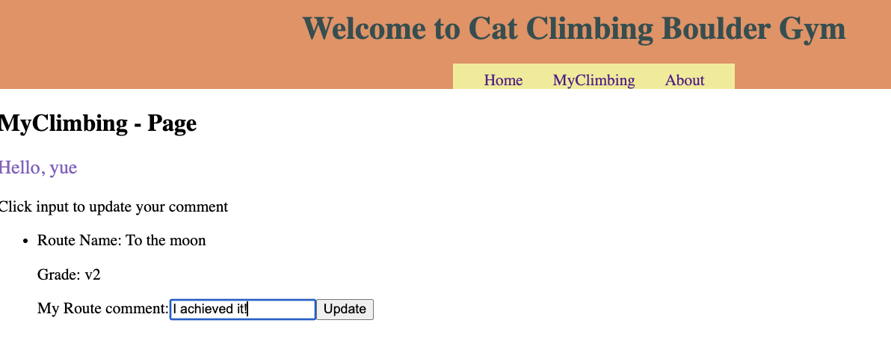
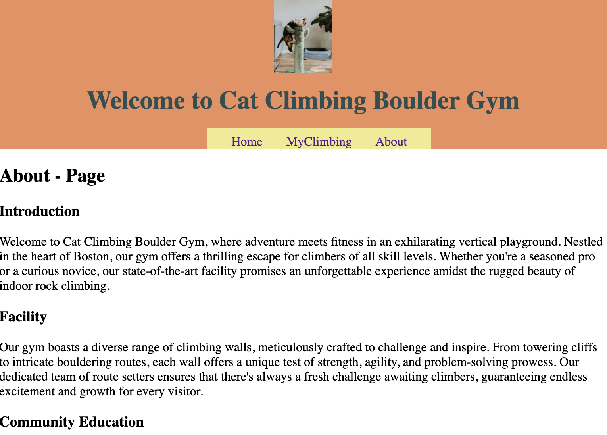
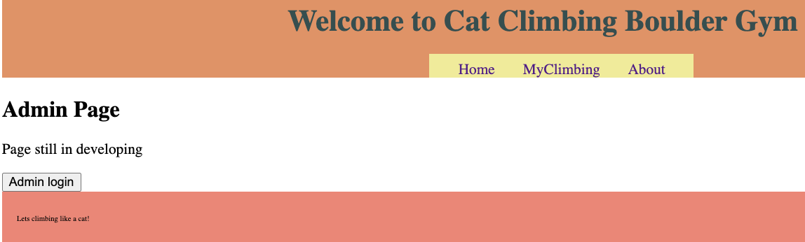

# Cat Climbing Boulder Gym

## Project Description

- This application aims to show climbing routes in the climbing gym, store users' climbing records, and help climbers view and share comments on various climbing routes.

## How to Use

`npm install`
`npm run build`
`npm start`

## Functions

- This application contains 3 main pages which are Home, MyClimbing, About. The nav bar in header can lead to different pages view.

- Before logging in: Users can only view the content of the About page to understand the basic introduction of the climbing gym. Other pages will ask users to login to explore more. In the Home page, users will see a login form. Entering a username will mimic the login process.

- After loggin in:

* Buttons in the lower left corner - "Admin login" mimic the admin login and will lead to a simple admin page.

* After logging in, users will see on the Home page the climbing routes that are currently open in the climbing gym, including route information and user comments on each route. Additionally, users can click "Add to My Record" to record their climbing experiences.

* After successfully adding climbing records, users can view their climbing records on the MyClimbing page and can also modify comments. Updated comments will also be reflected on the Home page.

- Admin login: the button at the left corner mimic an admin login scenario, it leads to the admin management page. (No function be added yet)

## Key points:

- Server:

* List of services

1. `GET/api/v1/session`
2. `POST/api/v1/session`
3. `DELETE/api/v1/session`
4. `POST/api/v1/comment`
5. `GET/api/v1/myclimbsession`
6. `PATCH/api/v1/updatecomment/:id`
7. `GET/api/v1/adminmanagement/`

- Handle page reload in production
  `res.sendFile(path.join(__dirname, "dist", "index.html"))`

- Client:

* List of views

1. Not login view
   
   
2. Loading user view
   
3. Logged in view
   
   
   
4. Admin view
   

- Header has mobile version adaptive

## Pictures License

- Pictures download from http://unsplash.com and follow the unsplash license:

* Unsplash visuals are made to be used freely. Our license reflects that.

* All images can be downloaded and used for free
  Commercial and non-commercial purposes
  No permission needed (though attribution is appreciated!)

* What is not permitted 👎
  Images cannot be sold without significant modification.
  Compiling images from Unsplash to replicate a similar or competing service.
  https://unsplash.com/license

1. Used in Header component

   - catclimbinglogo.jpg: https://unsplash.com/photos/brown-tabby-cat-on-green-cat-tree-I-rgDPLKogs

2. Used in climbing choices:

   - climbingRoute-toTheMoon.jpg: https://unsplash.com/photos/a-young-boy-is-climbing-on-a-climbing-wall-E-mQ9_VDbuU

   - climbingRoute-happyFriday.jpg: https://unsplash.com/photos/woman-rock-climbing-inside-building-NY1D4Zni7fc

   - climbingRoute-neverGiveUp.jpg: https://unsplash.com/photos/a-man-is-climbing-on-a-climbing-wall-gH5mpNXWI8o
